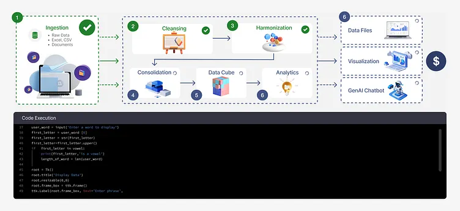

# DataIQ: AI-Powered Data Intelligence Platform 🚀


## 🌟 The Vision
DataIQ is more than just a data tool—it's a comprehensive **AI-Powered Data Intelligence Startup** designed to transform how organizations interact with their data. From seamless ingestion to predictive analysis and automated workflows, DataIQ is built to be the central nervous system for your data-driven decision-making.

---

## 🛠️ Core Features

### 🔌 Intelligent Data Connectors
Seamlessly connect to your entire stack. Whether it's **Cloud Platforms** (Google Drive, S3), **Databases** (PostgreSQL, Snowflake, BigQuery), or **IoT Streams**, DataIQ ingests and profiles your data automatically.



### 🧠 AI-Driven Analysis
Go beyond simple summaries. DataIQ uses frontier AI models (GPT-4o, Claude 3.5) to perform deep research, detect anomalies, and generate insights that drive real business value.

### 🔮 Custom Predictive Models
Empower your team to create and deploy **Custom AI Models** directly within the platform. Use your historical data for accurate predictive analysis and trend forecasting without leaving the DataIQ ecosystem.

### 🔄 Automated Workflows
Automate the mundane. Set up complex workflows to validate, profile, and analyze data as it arrives. From scheduled CRON jobs to webhook listeners, DataIQ keeps your intelligence fresh.

### 📊 Professional Dashboards & Reporting
- **Analyst Dashboards**: Real-time monitoring of your data health.
- **Dynamic Visualizations**: Interactive charts and data stories.
- **Automated Reports**: Generate professional PDF/Markdown reports and presentations with a single click.

### 🤝 Seamless Team Collaboration
Connect with **Slack** and **Microsoft Teams** to push AI summaries, alerts, and collaborative insights directly to your team's workspace.

---

## 🏗️ Technical Architecture


Our architecture is designed for high performance and infinite scalability, ensuring that your data intelligence grows with your business.

---

## 🚀 Getting Started

### Prerequisites
- Node.js (Latest LTS)
- npm or yarn

### Installation
```bash
# Install dependencies
npm install

# Start development server
npm run dev
```

### Production Build
```bash
# Create optimization production build
npm run build
```

---

## 🦞 Powered by DataIQ Intelligence


*Unlocking the true potential of your data, one insight at a time.*

---

© 2026 DataIQ Startup. Built for the future of research.